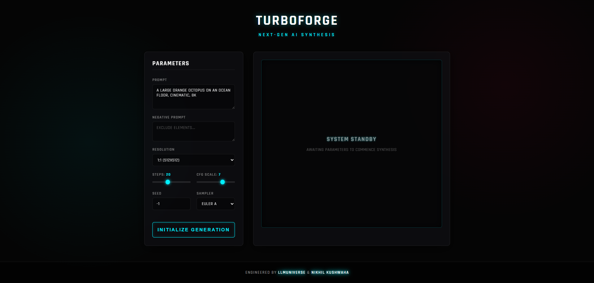
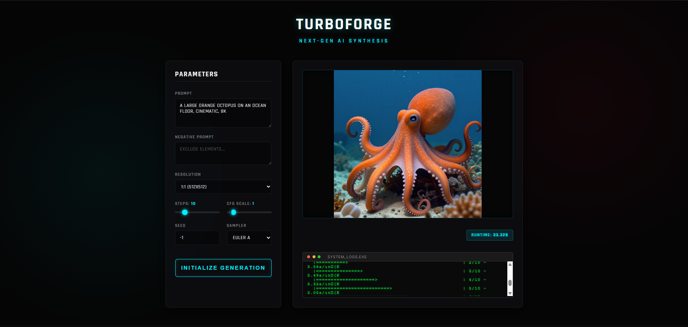

# ⚡ TURBOFORGE
### THE NEXT GENERATION OF AI SYNTHESIS

**FORGE HIGH-QUALITY IMAGES INSTANTLY ON BUDGET HARDWARE**

---

## 💎 THE TURBOFORGE EXPERIENCE
**TURBOFORGE** IS A PREMIUM, ONE-CLICK SOLUTION DESIGNED FOR THE MODERN AI ENTHUSIAST. WHETHER YOU'RE RUNNING AN NVIDIA RTX 3050 OR A BUDGET 4GB VRAM CARD, TURBOFORGE DELIVERS A SEAMLESS, HIGH-SPEED SYNTHESIS ENVIRONMENT WITH A STUNNING CYBERPUNK AESTHETIC.

### 🌌 WHY TURBOFORGE?
- **ONE-CLICK AUTOMATION:** DOUBLE-CLICK `RUN.BAT` AND WATCH THE MAGIC. NO COMPLEX SETUP, NO TERMINAL HEADACHES.
- **NEURAL OPTIMIZATION:** SQUEEZES MAXIMUM PERFORMANCE OUT OF GGUF QUANTIZED MODELS.
- **GLASSMORPHISM UI:** A STATE-OF-THE-ART INTERFACE THAT FEELS ALIVE, FEATURING GLITCH EFFECTS AND GLOWING ACCENTS.
- **TOTAL PRIVACY:** EVERYTHING RUNS 100% LOCALLY ON YOUR MACHINE.

---

## 📸 INTERFACE PREVIEW

  
  
<i>THE TURBOFORGE DASHBOARD: MINIMAL. POWERFUL. FUTURISTIC.</i>

---

## 📦 CORE COMPONENT DOWNLOADS
TO RUN TURBOFORGE, YOU MUST DOWNLOAD THESE COMPONENTS MANUALLY (DUE TO SIZE/LICENSE):

### 1️⃣ STABLE DIFFUSION ENGINE (SD-CLI.EXE)
- **DOWNLOAD:** [SD-CLI WIN-CUDA ZIP](https://github.com/leejet/stable-diffusion.cpp/releases/download/master-586-c97702e/sd-master-c97702e-bin-win-cuda12-x64.zip)
- **STEPS:** EXTRACT ALL FILES INTO THE `SD_BIN/` FOLDER.

### 2️⃣ CUDA RUNTIME DLLS
- **DOWNLOAD:** [CUDART DLLS ZIP](https://github.com/leejet/stable-diffusion.cpp/releases/download/master-586-c97702e/cudart-sd-bin-win-cu12-x64.zip)
- **STEPS:** EXTRACT ALL DLL FILES INTO THE `SD_BIN/` FOLDER.

### 3️⃣ Z-IMAGE TURBO MODEL (GGUF)
- **DOWNLOAD:** [Z-IMAGE-TURBO Q4_K](https://huggingface.co/leejet/Z-Image-Turbo-GGUF/resolve/main/z_image_turbo-Q4_K.gguf?download=true)
- **STEPS:** RENAME TO `Z_IMAGE_TURBO_Q4_0.GGUF` AND MOVE TO `MODELS/ZIMAGE/`.

### 4️⃣ QWEN3 4B TEXT ENCODER
- **DOWNLOAD:** [QWEN3-4B Q4_K_M](https://huggingface.co/unsloth/Qwen3-4B-GGUF/resolve/main/Qwen3-4B-Q4_K_M.gguf?download=true)
- **STEPS:** RENAME TO `QWEN3_4B_Q4_K_M.GGUF` AND MOVE TO `MODELS/LLM/`.

### 5️⃣ VAE (AUTOENCODER)
- **DOWNLOAD:** [AE.SAFETENSORS](https://github.com/dev-n1ck/visual-cpp-reds/releases/download/reds/ae.safetensors)
- **STEPS:** DOWNLOAD `AE.SAFETENSORS` AND MOVE TO `MODELS/VAE/` (DO NOT RENAME).

---

## 🛠️ SYSTEM REQUIREMENTS (MANDATORY)
1. **LATEST NVIDIA DRIVERS:** ENSURE YOUR NVIDIA DRIVERS ARE UPDATED TO THE LATEST VERSION (MANDATORY FOR CUDA).
2. **VISUAL C++ REDISTRIBUTABLES:** [DOWNLOAD VISUAL-CPP-AIO-DEC.ZIP](https://github.com/dev-n1ck/visual-cpp-reds/releases/download/reds/VISUAL-CPP-AIO-DEC.zip) (INSTALL THIS TO FIX DLL ERRORS).
3. **PYTHON 3.11 (X64):** [DIRECT DOWNLOAD FOR WINDOWS](https://www.python.org/ftp/python/3.11.9/python-3.11.9-amd64.exe) (MANDATORY).
4. **NODE.JS:** [DOWNLOAD PAGE](https://nodejs.org/en/download/prebuilt-binaries) (MANDATORY FOR UI).

---

## 🚀 QUICK SETUP
1. **DOWNLOAD THIS REPO.**
2. **INSTALL SYSTEM PREREQUISITES ABOVE.**
3. **RUN `RUN.BAT`.**
4. **FOLLOW THE ON-SCREEN INSTRUCTIONS TO ADD THE CORE COMPONENTS.**

---

## ⚠️ DISCLAIMER
**AUTOMATION TOOL:** THIS PROJECT IS BUILT FOR **SPEED AND AUTOMATION**. IT IS A STREAMLINED TOOL FOR USERS WHO WANT TO GENERATE OR TEST IMAGES WITHOUT MANUAL CONFIGURATION. IT DOES NOT PROVIDE DOCUMENTATION ON THE INTERNAL AI LOGIC OR MODEL ARCHITECTURES.

---

  <h3>FORGED BY LLMUNIVERSE & NIKHIL KUSHWAHA</h3>

